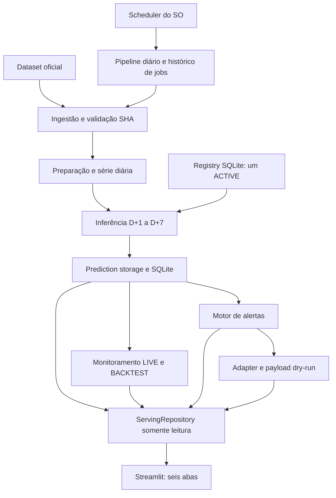
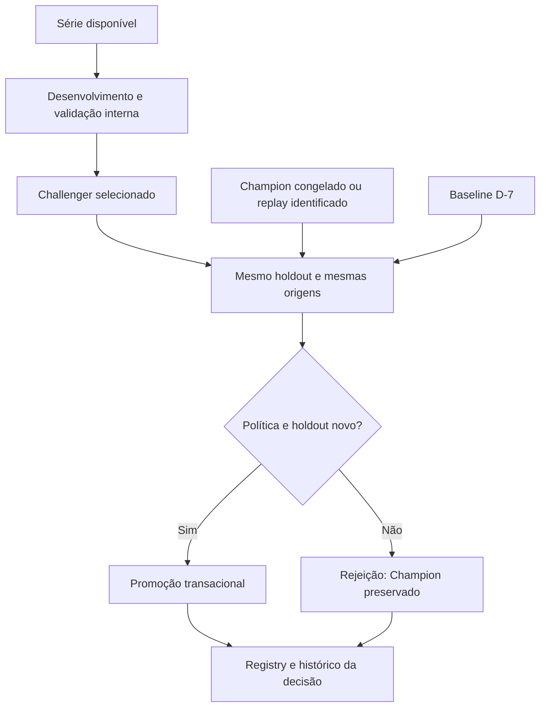

# Arquitetura implementada — pós-MVP

O scheduler real exige configuração local do usuário; scripts Windows/Linux estão prontos. Pipeline serial sob lock do SO. SQLite transacional e WAL. Nenhuma chamada externa no fluxo entregue.

Retreino semi-automatizado por entrypoint próprio. Monitoramento não dispara treino por drift automaticamente. Replay histórico demonstra treino/avaliação/rejeição com dados existentes; promoção exige janela inteiramente posterior ao treino Champion. Nenhuma promoção de produção foi fabricada.
